<div align="center">

<picture>
  <source media="(prefers-color-scheme: dark)" srcset="https://capsule-render.vercel.app/api?type=waving&color=0:1a1a2e,50:16213e,100:0f3460&height=120&section=header&text=Igor%20Santos&fontSize=36&fontColor=ffffff&animation=fadeIn&fontAlignY=65&desc=Back-End%20Developer%20%7C%20SaaS%20Builder%20%7C%20Brazil%20%E2%86%92%20World&descAlignY=85&descColor=8b949e&descSize=14"/>
  <source media="(prefers-color-scheme: light)" srcset="https://capsule-render.vercel.app/api?type=waving&color=0:dce9f5,50:b8d4ed,100:94bfe5&height=120&section=header&text=Igor%20Santos&fontSize=36&fontColor=1a1a2e&animation=fadeIn&fontAlignY=65&desc=Back-End%20Developer%20%7C%20SaaS%20Builder%20%7C%20Brazil%20%E2%86%92%20World&descAlignY=85&descColor=444444&descSize=14"/>
  
</picture>

<a href="https://github.com/IgorSantosD3v">
  
</a>

[](https://www.linkedin.com/in/igor-santos-devzao)
[](mailto:Igorsantosdevp@gmail.com)
[](https://www.instagram.com/igorp.y/?hl=en)
[](https://github.com/IgorSantosD3v)


<br/><br/>

<picture>
  <source media="(prefers-color-scheme: dark)" srcset="./assets/terminal-dark.svg"/>
  <source media="(prefers-color-scheme: light)" srcset="./assets/terminal-light.svg"/>
  
</picture>

</div>

---

### Índice

<div align="center">

<a href="#sobre-mim"><picture><source media="(prefers-color-scheme: dark)" srcset="./assets/indice/01-dark.svg"/><source media="(prefers-color-scheme: light)" srcset="./assets/indice/01-light.svg"/></picture></a>
<a href="#o-que-estou-construindo-agora"><picture><source media="(prefers-color-scheme: dark)" srcset="./assets/indice/02-dark.svg"/><source media="(prefers-color-scheme: light)" srcset="./assets/indice/02-light.svg"/></picture></a>
<a href="#experiência"><picture><source media="(prefers-color-scheme: dark)" srcset="./assets/indice/03-dark.svg"/><source media="(prefers-color-scheme: light)" srcset="./assets/indice/03-light.svg"/></picture></a>
<br/>
<a href="#projetos-em-destaque"><picture><source media="(prefers-color-scheme: dark)" srcset="./assets/indice/04-dark.svg"/><source media="(prefers-color-scheme: light)" srcset="./assets/indice/04-light.svg"/></picture></a>
<a href="#tecnologias"><picture><source media="(prefers-color-scheme: dark)" srcset="./assets/indice/05-dark.svg"/><source media="(prefers-color-scheme: light)" srcset="./assets/indice/05-light.svg"/></picture></a>
<a href="#formação"><picture><source media="(prefers-color-scheme: dark)" srcset="./assets/indice/06-dark.svg"/><source media="(prefers-color-scheme: light)" srcset="./assets/indice/06-light.svg"/></picture></a>
<br/>
<a href="#trajetória"><picture><source media="(prefers-color-scheme: dark)" srcset="./assets/indice/07-dark.svg"/><source media="(prefers-color-scheme: light)" srcset="./assets/indice/07-light.svg"/></picture></a>
<a href="#github"><picture><source media="(prefers-color-scheme: dark)" srcset="./assets/indice/08-dark.svg"/><source media="(prefers-color-scheme: light)" srcset="./assets/indice/08-light.svg"/></picture></a>
<a href="#contato"><picture><source media="(prefers-color-scheme: dark)" srcset="./assets/indice/09-dark.svg"/><source media="(prefers-color-scheme: light)" srcset="./assets/indice/09-light.svg"/></picture></a>

</div>

---

### Sobre mim

<table>
<tr>
<td valign="top" width="65%">

Sou desenvolvedor back-end e fundador de produto. Trabalho principalmente com Python (FastAPI) e C# (ASP.NET, ASP.NET MVC), construindo APIs REST, integrações com IA generativa e sistemas que lidam com dinheiro de verdade, mensagens de verdade e clientes de verdade.

Passei pelo desenvolvimento corporativo na Wooba, mantendo fluxos de busca de voos e hotéis de uma plataforma de viagens em produção, e hoje toco a **Flow**, minha marca de produtos SaaS. O principal deles é o **AgendaFlow**, um sistema de agendamento com Painel de Controle (um CRM completo), Painel Recepção e bot de atendimento por IA no WhatsApp, rodando em produção. Os clientes dos produtos Flow pagam suas mensalidades pelo **FlowPay**, nosso app de pagamentos. Antes da tecnologia, trabalhei na operação de indústrias farmacêuticas, e isso ficou: gosto de processo, de rastreabilidade e de sistema que não quebra quando o volume aumenta.

Concluí a formação em Desenvolvimento Back-end Python na EBAC, curso Engenharia de Software na FIAP e sigo estudando System Design, Clean Architecture, cloud e inglês para atuar em times internacionais.

**Buscando:** vaga de Desenvolvedor Back-end ou Full Stack, nível Júnior/Pleno, nacional ou internacional, remoto ou híbrido.

</td>
<td valign="top" width="35%" align="center">

<picture>
  <source media="(prefers-color-scheme: dark)" srcset="./assets/flowzinho-dark.svg"/>
  <source media="(prefers-color-scheme: light)" srcset="./assets/flowzinho-light.svg"/>
  
</picture>

</td>
</tr>
</table>

---

### O que estou construindo agora

<div align="center">

<picture>
  <source media="(prefers-color-scheme: dark)" srcset="./assets/produtos-dark.svg"/>
  <source media="(prefers-color-scheme: light)" srcset="./assets/produtos-light.svg"/>
  
</picture>

</div>

---

### Experiência

**Fundador e Desenvolvedor · Flow / Nexus Informática** (desde 05/2024)
Criação e operação de produtos SaaS próprios, do banco de dados ao deploy e à cobrança do cliente. Desenvolvi sozinho o AgendaFlow (FastAPI, PostgreSQL, Claude API, WhatsApp Cloud API), com Painel de Controle, Painel Recepção e bot de atendimento, e o app FlowPay em Flutter, com pagamentos via Mercado Pago e Asaas, workers agendados e infraestrutura no Railway. Pela Nexus Informática, também atuo como consultor e técnico de TI para empresas e escritórios: montagem e manutenção de desktops, suporte de hardware e software e gestão direta de clientes.

**Desenvolvedor Back-end · Wooba**
C#, ASP.NET MVC, APIs REST, JavaScript e jQuery em uma plataforma de reservas de viagens em produção. Implementei e depurei fluxos independentes de busca de voos e hotéis, corrigi problemas de roteamento, bugs de sincronização no motor de front-end e falhas de autenticação com fornecedores.

---

### Projetos em destaque

#### AgendaFlow · SaaS de agendamento via WhatsApp com IA


Empresas como barbearias, salões e clínicas contratam o AgendaFlow para operar a agenda de ponta a ponta. O produto tem três frentes:

- **Painel de Controle:** CRM completo da empresa, com cadastro de funcionários, serviços, unidades, clientes e agenda
- **Painel Recepção:** a rotina do balcão, com a agenda do dia e os atendimentos em tempo real
- **Bot WhatsApp:** os clientes agendam, remarcam e cancelam conversando no WhatsApp da própria empresa, com atendimento feito pelo Claude via tool-use, consultando a agenda real no banco

<div align="center">
<picture>
  <source media="(prefers-color-scheme: dark)" srcset="./assets/arquitetura-dark.svg"/>
  <source media="(prefers-color-scheme: light)" srcset="./assets/arquitetura-light.svg"/>
  
</picture>
</div>

- **IA com ferramentas reais:** loop de tool-use com o Claude para listar, criar, cancelar e reagendar horários, com controle de histórico que nunca separa pares `tool_use`/`tool_result`
- **Webhook resiliente:** deduplicação por `message_id`, expiração de conversa e resposta sempre 200 para evitar reenvio em cascata da Meta
- **Modelo multiunidade:** empresas, unidades com número próprio de WhatsApp, profissionais e serviços, com trava de conflito por profissional usando índices parciais
- **Pagamentos:** PIX via Mercado Pago para mensalidades e Asaas com subconta por empresa para sinais de agendamento, webhook de confirmação e estorno automático com camadas de segurança
- **Segurança:** API keys com HMAC + pepper, bcrypt + JWT nos painéis, validação real de CNPJ e rate limiting distribuído persistido no PostgreSQL
- **Operação:** workers agendados para cobrança e lembretes automáticos
- **Onboarding via Meta:** conexão do WhatsApp Business de cada empresa pelo Cadastro Incorporado (Embedded Signup)

🔒 Código privado (produto comercial). Demonstração técnica disponível em entrevista.

#### FlowPay · App de cobrança


App Android usado pelos clientes que contratam produtos Flow para acompanhar e pagar suas faturas. Login por código via WhatsApp, notificações push, atualização em tempo real, token em armazenamento seguro (Keystore) e tratamento completo de perda de conexão. Foi meu primeiro projeto mobile, levado do zero até a publicação.

🔒 Código privado (produto comercial). Demonstração técnica disponível em entrevista.

#### API de Livros · Back-end com observabilidade e CI/CD


API em FastAPI e SQLAlchemy com stack completa de observabilidade (Celery, Redis, Kafka e ELK com logs em JSON via Logstash), testes com pytest isolados por `conftest.py` e pipeline no GitHub Actions publicando imagens no GHCR e fazendo deploy em Kubernetes (Minikube) via runner self-hosted.

Repositório: [livros-api](https://github.com/IgorSantosD3v/livros-api)

#### Pokémon API · Projeto companheiro

API na mesma arquitetura da API de Livros, com tipos duplos, stats reais da primeira geração, endpoint de batalha e tarefas assíncronas com Celery.

Repositório: [pokemon-api](https://github.com/IgorSantosD3v/pokemon-api)

#### ViajaJá · Portal de viagens

Portal em React.js e TypeScript com arquitetura em Micro Frontends.

---

### Tecnologias

<div align="center">

**Back-end**

[](https://skillicons.dev)

**Front-end e mobile**

[](https://skillicons.dev)

**Dados e infraestrutura**

[](https://skillicons.dev)

**IA e integrações**

[](https://www.anthropic.com)
[](https://openai.com)
[](https://www.langchain.com)
[](https://developers.facebook.com/docs/whatsapp)
[](https://www.mercadopago.com.br)

</div>

| Área | Tecnologias |
|---|---|
| Back-end | Python, FastAPI, psycopg, SQLAlchemy, Celery, C#, ASP.NET, ASP.NET MVC, .NET, Node.js, NestJS |
| Front-end | Next.js, React.js, TypeScript, JavaScript, Tailwind CSS, HTML5, CSS, jQuery, Vite, Micro Frontends |
| Mobile | Flutter, Dart, Firebase Cloud Messaging |
| Dados | PostgreSQL, SQL Server, SQLite, Redis, SQL |
| Infraestrutura | Docker, Docker Compose, Kubernetes, GitHub Actions, GHCR, Railway, Apache Kafka, ELK Stack |
| IA | Claude API (tool-use), Claude Code, MCP, OpenAI, LangChain, LLMs locais |
| Pagamentos e mensageria | Mercado Pago (PIX), Asaas (subcontas), WhatsApp Cloud API, Meta Embedded Signup |
| Práticas | API REST, webhooks idempotentes, TDD, Clean Architecture, System Design, Git/GitHub, Postman |

---

### Formação

- **Engenharia de Software** · FIAP (em andamento)
- **Desenvolvimento Back-end Python** · EBAC (concluído)
- **EBAC · Escola Britânica de Artes Criativas e Tecnologia** · Desenvolvimento de API, Arquitetura de Software, Integração e Entrega Contínua (CI/CD), Desenvolvimento Back-end, Desenvolvimento Front-end, IA Generativa para Desenvolvedores Web, Programação Orientada a Objetos, Desenvolvimento Orientado a Testes
- **T.I do Zero ao Pro** · Introdução à Programação, Linux

<div align="center">


</div>

Estudar faz parte da rotina, não é uma etapa concluída. Os próximos alvos são certificações em cloud (AWS/Azure) e inglês profissional.

---

### Trajetória

```text
2023  Python, lógica de programação, POO, estruturas de dados
2024  APIs REST, banco de dados relacional, Git avançado
2024  C#, ASP.NET, ASP.NET MVC em produção na Wooba
2024  Fundação da Nexus Informática
2025  Docker, Kubernetes, PostgreSQL, SQL Server, GitHub Actions
2025  IA generativa: Claude API, OpenAI, LangChain
2025  System Design, Clean Architecture, DDD
2026  Conclusão do Back-end Python na EBAC
2026  AgendaFlow em produção: CRM, recepção, bot com IA e PIX
2026  Flutter e Firebase no app FlowPay
2026  Cloud (AWS/Azure) e inglês profissional em andamento
```

---

### GitHub

<div align="center">

<picture>
  <source media="(prefers-color-scheme: dark)" srcset="https://raw.githubusercontent.com/IgorSantosD3v/IgorSantosD3v/output/github-stats-dark.svg"/>
  <source media="(prefers-color-scheme: light)" srcset="https://raw.githubusercontent.com/IgorSantosD3v/IgorSantosD3v/output/github-stats-light.svg"/>
  
</picture>

<br/><br/>

<picture>
  <source media="(prefers-color-scheme: dark)" srcset="https://raw.githubusercontent.com/IgorSantosD3v/IgorSantosD3v/output/github-snake-dark.svg"/>
  <source media="(prefers-color-scheme: light)" srcset="https://raw.githubusercontent.com/IgorSantosD3v/IgorSantosD3v/output/github-snake.svg"/>
  
</picture>

</div>

---

### Contato

Aberto a oportunidades nacionais e internacionais como desenvolvedor Back-end ou Full Stack. Se você quer conversar sobre uma vaga, um projeto ou trocar ideia sobre IA aplicada a produto, me chama no LinkedIn ou por email.

<div align="center">

[](https://www.linkedin.com/in/igor-santos-devzao)
[](mailto:Igorsantosdevp@gmail.com)

</div>

---

<div align="center">
<sub>IgorSantosD3v · Anápolis, GO · Brazil</sub>

<picture>
  <source media="(prefers-color-scheme: dark)" srcset="https://capsule-render.vercel.app/api?type=waving&color=0:0f3460,50:16213e,100:1a1a2e&height=100&section=footer"/>
  <source media="(prefers-color-scheme: light)" srcset="https://capsule-render.vercel.app/api?type=waving&color=0:94bfe5,50:b8d4ed,100:dce9f5&height=100&section=footer"/>
  
</picture>

</div>
