<picture>
  <source media="(prefers-color-scheme: dark)" srcset="./assets/header-dark.svg"/>
  <source media="(prefers-color-scheme: light)" srcset="./assets/header-light.svg"/>
  
</picture>

  

<picture>
  <source media="(prefers-color-scheme: dark)" srcset="./assets/terminal-dark.svg"/>
  <source media="(prefers-color-scheme: light)" srcset="./assets/terminal-light.svg"/>
  
</picture>

### Índice

<a href="#sobre-mim"><picture><source media="(prefers-color-scheme: dark)" srcset="./assets/indice/01-dark.svg"/><source media="(prefers-color-scheme: light)" srcset="./assets/indice/01-light.svg"/></picture></a>
<a href="#o-que-estou-construindo-agora"><picture><source media="(prefers-color-scheme: dark)" srcset="./assets/indice/02-dark.svg"/><source media="(prefers-color-scheme: light)" srcset="./assets/indice/02-light.svg"/></picture></a>
<a href="#experiência"><picture><source media="(prefers-color-scheme: dark)" srcset="./assets/indice/03-dark.svg"/><source media="(prefers-color-scheme: light)" srcset="./assets/indice/03-light.svg"/></picture></a>
 
<a href="#projetos-em-destaque"><picture><source media="(prefers-color-scheme: dark)" srcset="./assets/indice/04-dark.svg"/><source media="(prefers-color-scheme: light)" srcset="./assets/indice/04-light.svg"/></picture></a>
<a href="#tecnologias"><picture><source media="(prefers-color-scheme: dark)" srcset="./assets/indice/05-dark.svg"/><source media="(prefers-color-scheme: light)" srcset="./assets/indice/05-light.svg"/></picture></a>
<a href="#formação"><picture><source media="(prefers-color-scheme: dark)" srcset="./assets/indice/06-dark.svg"/><source media="(prefers-color-scheme: light)" srcset="./assets/indice/06-light.svg"/></picture></a>
 
<a href="#trajetória"><picture><source media="(prefers-color-scheme: dark)" srcset="./assets/indice/07-dark.svg"/><source media="(prefers-color-scheme: light)" srcset="./assets/indice/07-light.svg"/></picture></a>
<a href="#github"><picture><source media="(prefers-color-scheme: dark)" srcset="./assets/indice/08-dark.svg"/><source media="(prefers-color-scheme: light)" srcset="./assets/indice/08-light.svg"/></picture></a>
<a href="#contato"><picture><source media="(prefers-color-scheme: dark)" srcset="./assets/indice/09-dark.svg"/><source media="(prefers-color-scheme: light)" srcset="./assets/indice/09-light.svg"/></picture></a>

### Sobre mim

<table>
<tr>
<td valign="top" width="65%">

Sou desenvolvedor back-end e fundador de produto. Trabalho principalmente com Python (FastAPI) e C# (ASP.NET, ASP.NET MVC), construindo APIs REST, integrações com IA generativa e sistemas que lidam com dinheiro de verdade, mensagens de verdade e clientes de verdade.

Passei pelo desenvolvimento corporativo na Wooba, mantendo fluxos de busca de voos e hotéis de uma plataforma de viagens em produção, e hoje toco a **Flow**, minha marca de produtos SaaS. O principal deles é o **AgendaFlow**, um sistema de agendamento com Painel de Controle (um CRM completo), Painel Recepção e bot de atendimento por IA no WhatsApp, rodando em produção. Os clientes dos produtos Flow pagam suas mensalidades pelo **FlowPay**, nosso app de pagamentos. Antes da tecnologia, trabalhei na operação de indústrias farmacêuticas, e isso ficou: gosto de processo, de rastreabilidade e de sistema que não quebra quando o volume aumenta.

Concluí a formação em Desenvolvimento Back-end Python na EBAC, curso Engenharia de Software na FIAP e sigo estudando System Design, Clean Architecture, cloud e inglês para atuar em times internacionais.

**Buscando:** vaga de Desenvolvedor Back-end ou Full Stack, nível Júnior/Pleno, nacional ou internacional, remoto ou híbrido.

</td>
<td valign="top" width="35%" align="center">

<picture>
  <source media="(prefers-color-scheme: dark)" srcset="./assets/flowzinho-dark.svg"/>
  <source media="(prefers-color-scheme: light)" srcset="./assets/flowzinho-light.svg"/>
  
</picture>

</td>
</tr>
</table>

### O que estou construindo agora

<picture>
  <source media="(prefers-color-scheme: dark)" srcset="./assets/produtos-dark.svg"/>
  <source media="(prefers-color-scheme: light)" srcset="./assets/produtos-light.svg"/>
  
</picture>

### Experiência

<picture>
  <source media="(prefers-color-scheme: dark)" srcset="./assets/experiencia-dark.svg"/>
  <source media="(prefers-color-scheme: light)" srcset="./assets/experiencia-light.svg"/>
  
</picture>

### Projetos em destaque

#### AgendaFlow · SaaS de agendamento via WhatsApp com IA

Empresas como barbearias, salões e clínicas contratam o AgendaFlow para operar a agenda de ponta a ponta. O produto tem três frentes:

- **Painel de Controle:** CRM completo da empresa, com cadastro de funcionários, serviços, unidades, clientes e agenda
- **Painel Recepção:** a rotina do balcão, com a agenda do dia e os atendimentos em tempo real
- **Bot WhatsApp:** os clientes agendam, remarcam e cancelam conversando no WhatsApp da própria empresa, com atendimento feito pelo Claude via tool-use, consultando a agenda real no banco

<picture>
  <source media="(prefers-color-scheme: dark)" srcset="./assets/arquitetura-dark.svg"/>
  <source media="(prefers-color-scheme: light)" srcset="./assets/arquitetura-light.svg"/>
  
</picture>

- **IA com ferramentas reais:** loop de tool-use com o Claude para listar, criar, cancelar e reagendar horários, com controle de histórico que nunca separa pares `tool_use`/`tool_result`
- **Webhook resiliente:** deduplicação por `message_id`, expiração de conversa e resposta sempre 200 para evitar reenvio em cascata da Meta
- **Modelo multiunidade:** empresas, unidades com número próprio de WhatsApp, profissionais e serviços, com trava de conflito por profissional usando índices parciais
- **Pagamentos:** PIX via Mercado Pago para mensalidades e Asaas com subconta por empresa para sinais de agendamento, webhook de confirmação e estorno automático com camadas de segurança
- **Segurança:** API keys com HMAC + pepper, bcrypt + JWT nos painéis, validação real de CNPJ e rate limiting distribuído persistido no PostgreSQL
- **Operação:** workers agendados para cobrança e lembretes automáticos
- **Onboarding via Meta:** conexão do WhatsApp Business de cada empresa pelo Cadastro Incorporado (Embedded Signup)

🔒 Código privado (produto comercial). Demonstração técnica disponível em entrevista.

#### FlowPay · App de cobrança

App Android usado pelos clientes que contratam produtos Flow para acompanhar e pagar suas faturas. Login por código via WhatsApp, notificações push, atualização em tempo real, token em armazenamento seguro (Keystore) e tratamento completo de perda de conexão. Foi meu primeiro projeto mobile, levado do zero até a publicação.

🔒 Código privado (produto comercial). Demonstração técnica disponível em entrevista.

#### Outros projetos

<a href="https://github.com/IgorSantosD3v/livros-api"><picture><source media="(prefers-color-scheme: dark)" srcset="./assets/projetos/livros-dark.svg"/><source media="(prefers-color-scheme: light)" srcset="./assets/projetos/livros-light.svg"/></picture></a>
<a href="https://github.com/IgorSantosD3v/pokemon-api"><picture><source media="(prefers-color-scheme: dark)" srcset="./assets/projetos/pokemon-dark.svg"/><source media="(prefers-color-scheme: light)" srcset="./assets/projetos/pokemon-light.svg"/></picture></a>
<picture><source media="(prefers-color-scheme: dark)" srcset="./assets/projetos/viajaja-dark.svg"/><source media="(prefers-color-scheme: light)" srcset="./assets/projetos/viajaja-light.svg"/></picture>

### Tecnologias

<picture>
  <source media="(prefers-color-scheme: dark)" srcset="./assets/tecnologias-dark.svg"/>
  <source media="(prefers-color-scheme: light)" srcset="./assets/tecnologias-light.svg"/>
  
</picture>

### Formação

<picture>
  <source media="(prefers-color-scheme: dark)" srcset="./assets/formacao-dark.svg"/>
  <source media="(prefers-color-scheme: light)" srcset="./assets/formacao-light.svg"/>
  
</picture>

### Trajetória

<picture>
  <source media="(prefers-color-scheme: dark)" srcset="./assets/trajetoria-dark.svg"/>
  <source media="(prefers-color-scheme: light)" srcset="./assets/trajetoria-light.svg"/>
  
</picture>

### GitHub

<picture>
  <source media="(prefers-color-scheme: dark)" srcset="https://raw.githubusercontent.com/IgorSantosD3v/IgorSantosD3v/output/github-stats-dark.svg"/>
  <source media="(prefers-color-scheme: light)" srcset="https://raw.githubusercontent.com/IgorSantosD3v/IgorSantosD3v/output/github-stats-light.svg"/>
  
</picture>

  

<picture>
  <source media="(prefers-color-scheme: dark)" srcset="https://raw.githubusercontent.com/IgorSantosD3v/IgorSantosD3v/output/github-snake-dark.svg"/>
  <source media="(prefers-color-scheme: light)" srcset="https://raw.githubusercontent.com/IgorSantosD3v/IgorSantosD3v/output/github-snake.svg"/>
  
</picture>

### Contato

<picture>
  <source media="(prefers-color-scheme: dark)" srcset="./assets/contato-dark.svg"/>
  <source media="(prefers-color-scheme: light)" srcset="./assets/contato-light.svg"/>
  
</picture>

IgorSantosD3v · Anápolis, GO · Brazil

